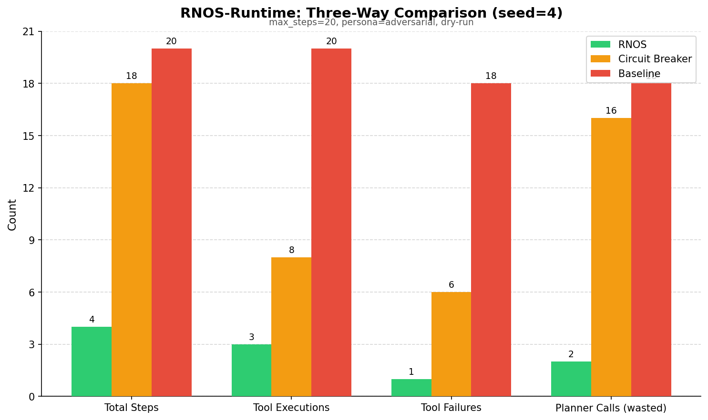
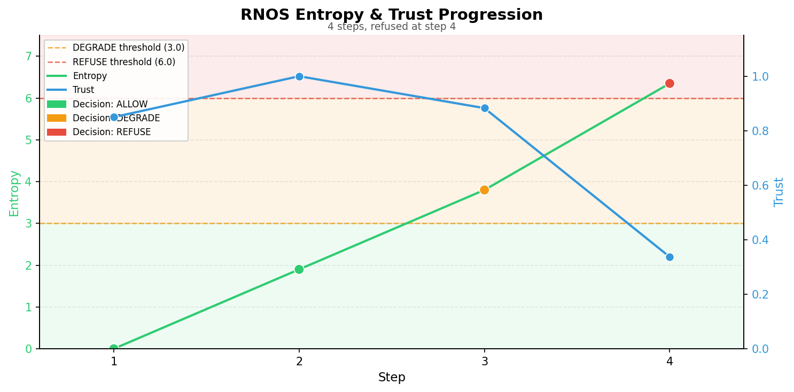

# RNOS Runtime

> Compute like water. Contain like fire.

**RNOS Runtime is a control layer for autonomous AI systems that determines when execution should stop.**

In dry-run testing with seed=4 and 20 max steps, RNOS reduced tool failures by 94% and terminated runaway execution 16 steps before an uncontrolled baseline.



---

## Results

Three execution strategies tested against the same failure-prone API simulation (UnstableAPI: 2 stable calls → 3 probabilistic calls → guaranteed cascade failure). Dry-run mode; planner stub used (no LM Studio required for reproducibility).

| Metric | RNOS | Circuit Breaker | Baseline |
|---|---|---|---|
| Mode | rnos | circuit_breaker | baseline |
| Total Steps | 4 | 18 | 20 |
| Tool Executions | 3 | 8 | 20 |
| Tool Failures | 1 | 6 | 18 |
| Blocked/Refused Steps | 1 | 10 | 0 |
| First Intervention | step 3 (degrade) | step 6 (half_open) | N/A |
| Final State | refused | permanently_open | completed |
| Seed | 4 | 4 | 4 |
| Persona | adversarial | adversarial | adversarial |

**Reduction vs baseline:**

| Metric | RNOS | Circuit Breaker |
|---|---|---|
| Step Reduction | -80.0% | -10.0% |
| Execution Reduction | -85.0% | -60.0% |
| Failure Reduction | -94.4% | -66.7% |

**Key findings:**

- RNOS stopped execution at step 4 with 1 tool failure. Baseline ran all 20 steps with 18 failures.
- The circuit breaker reduced tool executions by 60% but still ran 18 steps — blocked calls still triggered planner inference on every step.
- RNOS is the only approach that terminates the loop entirely, saving both tool and planner compute.
- RNOS first intervened at step 3 with a DEGRADE decision, allowing one constrained retry before refusing at step 4 (entropy=6.35, trust=0.337).

---

## How It Works

RNOS evaluates every proposed action before execution using two signals:

**Entropy** — a composite instability score derived from:
- Execution depth (how deep in the call chain)
- Retry count (consecutive failures)
- Recent failure rate (last 5 actions)
- Tool repetition (same tool called repeatedly)
- Planner latency (LLM inference time as a stress signal)
- Cumulative cost (total work done in the loop)

**Trust** — a confidence score (0.0–1.0) based on recent success rate, penalized by entropy.

These combine into three decisions:

| Decision | Condition | Effect |
|---|---|---|
| **ALLOW** | entropy < 3.0, trust > 0.45 | Execute normally |
| **DEGRADE** | entropy 3.0–6.0 or trust 0.2–0.45 | Execute with constraints (no side effects, limited retries) |
| **REFUSE** | entropy ≥ 6.0 or trust ≤ 0.2 | Terminate execution |



Entropy accumulates across steps as failures compound. Trust degrades inversely. In the test run above, RNOS transitioned from ALLOW (steps 1–2) to DEGRADE (step 3, entropy=3.8) to REFUSE (step 4, entropy=6.35) as instability escalated. The circuit breaker reached the same endpoint through 14 more steps.

---

## Terminal Output

```
$ python scripts/run_agent.py --max-steps 20 --seed 4 --dry-run

[DRY RUN] LM Studio not called -- planner returns 'CALL unstable_api' always
=== LM Studio RNOS Loop ===
mode=rnos seed=4 max_steps=20 persona=adversarial

[step 01] llm_output='CALL unstable_api' depth=0 entropy=0.000 trust=0.850 decision=ALLOW retry_count=0
           tool_result=SUCCESS (API call succeeded)
           phase=stable call_count=1 failure_streak=0

[step 02] llm_output='CALL unstable_api' depth=1 entropy=1.900 trust=1.000 decision=ALLOW retry_count=0
           tool_result=SUCCESS (API call succeeded)
           phase=stable call_count=2 failure_streak=0

[step 03] llm_output='CALL unstable_api' depth=2 entropy=3.800 trust=0.883 decision=DEGRADE retry_count=0
           degraded_mode=True constraints={"allow_side_effects": false, "max_additional_steps": 1}
           tool_result=FAILURE (transient_failure)
           phase=unstable call_count=3 failure_streak=1

[step 04] llm_output='CALL unstable_api' depth=3 entropy=6.350 trust=0.337 decision=REFUSE retry_count=1
           stop=RNOS refused execution
```

---

## Architecture

```
User
  |
Agent (LLM Planner)
  |
RNOS Runtime  <-- evaluates every action before execution
  |
Tools (APIs, DB, File System)
```

RNOS sits between decision and action. It does not replace the planner — it gates the planner's output.

---

## Compared Approaches

### RNOS (Entropy-Aware Gate)
- Tracks system-wide instability across six weighted signals
- Graduated response: ALLOW → DEGRADE → REFUSE
- Terminates the loop on REFUSE — saves both tool and planner compute
- First intervention at step 3 via DEGRADE (one constrained retry allowed)

### Circuit Breaker (Exponential Backoff)
- Standard production pattern (AWS, gRPC, Kubernetes)
- Binary: allow or block (no degraded mode)
- Blocks tool calls but the agent loop keeps running — planner still infers on every blocked step
- Recovery probes into a dead endpoint waste additional tool calls
- Reached PERMANENTLY_OPEN at step 18 after 10 blocked steps

### Baseline (No Intervention)
- Loop runs until step budget exhausted
- All failures absorbed, no termination signal
- 18 of 20 calls failed; execution continued regardless

---

## Quick Start

### Prerequisites
- Python 3.11+
- LM Studio (optional — `--dry-run` works without it)

### Install
```bash
pip install -e .
```

### Run a Single Mode
```bash
# RNOS (default)
python scripts/run_agent.py --max-steps 20 --seed 4

# Circuit breaker
python scripts/run_agent.py --max-steps 20 --seed 4 --circuit-breaker

# Baseline (no protection)
python scripts/run_agent.py --max-steps 20 --seed 4 --no-rnos

# Dry run (no LM Studio needed)
python scripts/run_agent.py --max-steps 20 --seed 4 --dry-run
```

### Run All Three and Generate Report
```bash
python scripts/run_comparison.py --max-steps 20 --seed 4 --tag "my-test"

# With live LM Studio
python scripts/run_comparison.py --max-steps 20 --seed 4 --tag "live-qwen3-4b"

# Dry run
python scripts/run_comparison.py --max-steps 20 --seed 4 --dry-run --tag "verify"
```

### Generate Report from Existing Data
```bash
python scripts/generate_report.py --tag "my-test"
python scripts/generate_report.py --seed 4
python scripts/generate_report.py --no-chart   # skip PNG generation
```

Results are saved to `results/runs.jsonl`. Reports and charts go to `results/`.

### Planner Personas
```bash
# Adversarial (default): "retry forever"
python scripts/run_agent.py --max-steps 15 --seed 4 --persona adversarial

# Cautious: "stop after two failures"
python scripts/run_agent.py --max-steps 15 --seed 4 --persona cautious

# Mixed: "try 3 times then switch tools"
python scripts/run_agent.py --max-steps 15 --seed 4 --persona mixed
```

---

## Project Structure

```
rnos/                  # Core runtime
  entropy.py           # Entropy calculation (6 weighted signals)
  trust.py             # Trust model (success-rate baseline minus entropy penalty)
  policy.py            # ALLOW/DEGRADE/REFUSE policy engine
  runtime.py           # Main evaluation loop
  types.py             # Shared data structures

baselines/             # Non-RNOS comparison strategies
  circuit_breaker.py   # Exponential backoff circuit breaker

agent/                 # LLM planner integration
  planner.py           # LM Studio OpenAI-compatible client
  parser.py            # Action parser (CALL <tool> [payload])
  loop.py              # Agent loop (legacy, see run_agent.py)

tools/                 # Tool implementations
  unstable_api.py      # Failure-prone API simulation
  calculator.py        # Safe arithmetic tool
  file_ops.py          # Sandboxed file operations

scripts/               # Entry points
  run_agent.py                 # Single-mode runner
  run_comparison.py            # Three-way batch runner
  generate_report.py           # Markdown + chart report generator
  generate_entropy_chart.py    # Entropy/trust progression chart

docs/                  # README assets (committed)
results/               # Run data (gitignored)
```

---

## Why Refusal Matters

As AI agents become more capable, they also become more unpredictable. They take actions, call tools, make decisions in loops. Traditional approaches — monitoring, logging, retrying, scaling — answer "what happened?" but not "should this continue?"

RNOS introduces refusal as a first-class primitive. Instead of retrying indefinitely or continuing blindly, the system can determine that execution has become unsafe and stop.

This is not about making systems perfect. It is about making systems that know when they have lost the right to continue.

> A system should know when it has lost the right to continue.

---

## License

MIT

## Author

Rowan Ashford
